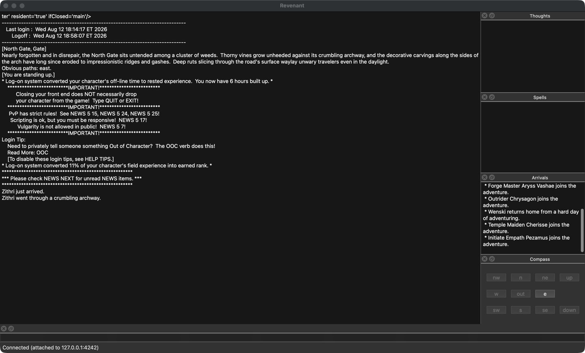

# Revenant

_Python and DragonRealms — a monorepo of hobby projects for the [DragonRealms](https://www.play.net/dr/) MUD._

Most of the tooling around DragonRealms lives in the Ruby ecosystem (lich, dr-scripts, profanity, Genie plugins). Revenant is an excuse to rebuild some of that in Python, have fun, and see what sticks. None of these projects are polished or production-ready — they are prototypes, experiments, and works-in-progress.

Shout out to [Pylanthia](https://github.com/robbintt/pylanthia), a great related project.

## Getting started

The repo is a [uv](https://docs.astral.sh/uv/) workspace. `client/` and `chat/` are workspace members with their own `pyproject.toml`; `beholder/` is deliberately outside the workspace because its pinned deps are incompatible with modern Python (see [beholder/README.md](beholder/README.md)).

```sh
# Install uv: https://docs.astral.sh/uv/getting-started/installation/
uv sync                       # create the workspace venv + install everything
uv run pytest --rootdir client   # run the client test suite
uv run -- python -m client.gui.client_gui   # launch the PyQt6 client
```

Python 3.10+ is required. (The old `telnetlib` dependency — removed from the stdlib in Python 3.13 — was replaced by [client/client/netsock.py](client/client/netsock.py), a minimal buffered socket client.)

## Projects

| Directory | What it is |
|---|---|
| [client/](client/) | A Python MUD client and engine — aims to be a [lich](https://lichproject.org/)-style middleman with a PyQt6 front end and a (WIP) terminal front end. |
| [beholder/](beholder/) | A [Dash](https://plotly.com/dash/) web dashboard for visualizing character experience gains in real time, fed by a lich script writing to SQLite. |
| [chat/](chat/) | A standalone LNet chat client, roughly a Python port of rcuhljr's [Genie LNet plugin](https://github.com/rcuhljr/genie-lnet-plugin/). |
| [launcher/](launcher/) | Small helper scripts for spinning up a headless lich instance alongside [ProfanityFE](https://github.com/elanthia-online/profanity-fe). |

### client
A rough-draft engine + front ends for playing DragonRealms with Python in the loop.



- **core** — the engine/middleman between the game and whichever front end is attached. See [client/client/core.py](client/client/core.py).
- **session** — a detachable session daemon that logs in, owns the game socket, and serves parsed game text to any number of front ends over localhost, lich-style. Also hosts the Python script engine (`;list`, `;run`, `;stop`). See [client/client/session.py](client/client/session.py).
- **gui** — a PyQt6 front end reminiscent of the old AOL-era Gemstone clients, rendering the game's own styling markers: amber room names, blue speech, bold alerts. The Experience dock is a live skill dashboard (rank, percent, mindstate per learning skill), and `;xp` logs the same data to `~/.revenant/xp.db` for history and analysis. See [client/client/gui/client_gui.py](client/client/gui/client_gui.py).
- **tui** — a non-working draft of a terminal front end. [Profanity](https://github.com/elanthia-online/profanity-fe) is what you actually want for a TUI today; this is just a sketch.

Python 3.10–3.12. Packaged via [client/pyproject.toml](client/pyproject.toml) as a member of the root uv workspace.

#### Hot code reload: `;reexec`

Type `;reexec` in any attached front end to **update the running session
to the latest code without logging out** — your character never leaves the
game, and the connection to the server stays open the whole time.

This exists because a running session loads its code once, at startup:
edits on disk don't take effect until the process restarts, and restarting
used to mean logging out and back in.

How it works:

1. The session stops running scripts, marks the game socket's file
   descriptor inheritable, and stashes any not-yet-parsed game bytes in an
   environment variable.
2. It then `exec`s a fresh `python -m client.session --game-fd N`. The exec
   closes the listener and every front-end connection (those are
   per-process); only the game socket survives, adopted by the new process
   via `SocketClient.from_fd`.
3. The new session restores the byte buffer, rebinds the localhost port,
   and sends a single `look` to reprime its cold parser state (room title,
   compass).
4. Front ends notice the drop and reattach automatically (retrying for up
   to ~10 s — in practice it's sub-second). In the GUI you'll see
   `session dropped — reattaching ...` followed by `reattached`.

Caveats: running scripts are stopped, not resumed (start them again with
`;run`); a session older than this feature doesn't know `;reexec`, so the
first upgrade still needs one old-fashioned QUIT-and-relaunch.

### beholder
A browser-based dashboard for character experience gains, built with Dash/Plotly on top of a SQLite database.

The pipeline:
1. [beholder/revenant.lic](beholder/revenant.lic) runs inside lich, polling `DRSkill` every 60s and writing rows into a SQLite database.
2. [beholder/app.py](beholder/app.py) reads from that database via SQLAlchemy and renders a Dash app with per-character, per-skill mindstate plots that refresh on an interval.

See [beholder/README.md](beholder/README.md) for setup. Note: the pinned dependencies in [beholder/requirements.txt](beholder/requirements.txt) are old — Dash 0.22, Flask 1.0, pandas 0.23 — and the code uses the deprecated `dash_core_components` / `dash_html_components` / `dash_table_experiments` imports, so it won't run under a modern Dash without porting. That's why beholder is **not** part of the uv workspace yet.

### chat
A minimal LNet client in pure Python (stdlib `ssl` only, no dependencies). Connects to `lnet.lichproject.org:7155`, verifies the server against the pinned CA in [chat/LnetCert.txt](chat/LnetCert.txt) plus the `lichproject.org`/`LichNet` CN check the reference client uses, handles the login XML handshake, answers pings, and parses the incoming XML stream into typed `LnetMessage`s. See [chat/chat.py](chat/chat.py). Run with `uv run python chat/chat.py`.

LNet names can be password-protected on the server (protocol per `lnet.lic` 1.15): if a name is protected, login must carry a `password` attribute or the server answers `password required` and disconnects. Configure via environment:

- `LNET_NAME` — the name to log in as (defaults to `Wabbajack`, which is currently password-protected — set your own).
- `LNET_PASSWORD` — the password for that name; alternatively put it in the git-ignored `chat/lnet_password.txt`. Never commit it.
- `LNET_DEBUG` — set to anything for raw protocol dumps.

To password-protect a name (or change it), log in and call `Server.register_password("...")`; pass the literal string `"nil"` to remove protection. Forgotten passwords are reset at <https://lnet.lichproject.org>.

Typing `;lnet` in a revenant front end brings LNet into the GUI's Thoughts window — chat renders there lich-style (`[Channel]-Name: "msg"`), and the classic commands work as they always did: `;chat <msg>` (default channel), `;chat on <channel> <msg>`, `;chat to <name> <msg>`, `;reply`, `;who [name]`, `;stats`, `;channels [all]`, `;tune`/`;untune <channel>`. The grammar is a 1:1 port of lnet.lic, and `;chat` even starts the connection on demand. `;help lnet` shows the manual in-game; `;stop lnet` disconnects. (Replies to `;who`/`;stats`/`;channels` aren't rendered yet — [#30](https://github.com/jandersson/revenant/issues/30).)

### launcher
[launcher/launch.py](launcher/launch.py) picks a free port, starts lich headless with `--detachable-client`, and attaches a Profanity front end to it. Paths are currently hard-coded for the author's machine — treat it as a template rather than a turnkey tool.

## Layout

```
revenant/
├── beholder/   # Dash/Plotly XP dashboard + lich data-logging script
├── chat/       # LNet chat client
├── client/     # PyQt6 client + engine (core/gui/tui)
└── launcher/   # Helpers for launching lich + profanity together
```

## Status

Hobby-grade. Things are in varying states of disrepair — the client is the most actively poked at, beholder is dormant but fun, chat works, and launcher is a convenience script. Expect to read code before running anything.

## License

MIT (see [client/pyproject.toml](client/pyproject.toml)).
