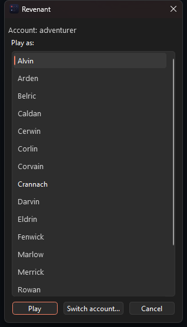

<p align="center">
  
</p>

# Revenant

_Python and DragonRealms — a monorepo of hobby projects for the [DragonRealms](https://www.play.net/dr/) MUD._

Most of the tooling around DragonRealms lives in the Ruby ecosystem (lich, dr-scripts, profanity, Genie plugins). Revenant is an excuse to rebuild some of that in Python, have fun, and see what sticks — [docs/why-python.md](docs/why-python.md) records what that trade buys and costs, with the evidence. None of these projects are polished or production-ready — they are prototypes, experiments, and works-in-progress.

Revenant is a hobby, built for fun and for the author's own play. It is inspired by Lich and the community's scripts, and exists because nothing like them existed for Python; the [Friends](#friends) section and [docs/bibliography.md](docs/bibliography.md) credit what it leans on. The client, GUI, chat client and beholder were hand-written and working years before any AI was involved (the history runs from 2018). Since spring 2026 much of the new code is written with Claude Code, and the commit history says which; it speeds up delivery, and the direction is the author's.

Shout out to [Pylanthia](https://github.com/robbintt/pylanthia), a great related project.

## Getting started

The repo is a [uv](https://docs.astral.sh/uv/) workspace. `client/`, `chat/`, and `beholder/` are workspace members with their own `pyproject.toml`.

```sh
# Install uv: https://docs.astral.sh/uv/getting-started/installation/
uv sync                       # create the workspace venv + install everything
uv run pytest --rootdir client   # run the client test suite
uv run -- python -m client.gui.client_gui   # launch the PyQt6 client
```

Python 3.10+ is required. (The old `telnetlib` dependency — removed from the stdlib in Python 3.13 — was replaced by [client/client/netsock.py](client/client/netsock.py), a minimal buffered socket client.)

## Projects

| Directory | What it is |
|---|---|
| [client/](client/) | A Python MUD client and engine — aims to be a [lich](https://lichproject.org/)-style middleman with a PyQt6 frontend and a (WIP) terminal frontend. |
| [beholder/](beholder/) | A [Dash](https://plotly.com/dash/) web dashboard for character experience history, reading the SQLite log the client's bundled xp script writes. |
| [chat/](chat/) | A standalone LNet chat client, roughly a Python port of rcuhljr's [Genie LNet plugin](https://github.com/rcuhljr/genie-lnet-plugin/). |
| [launcher/](launcher/) | Small helper scripts for spinning up a headless lich instance alongside [ProfanityFE](https://github.com/elanthia-online/profanity-fe). |

### client
A rough-draft engine + frontends for playing DragonRealms with Python in the loop.


- **core** — the engine/middleman between the game and whichever frontend is attached. See [client/client/core.py](client/client/core.py).
- **session** — a detachable session daemon that logs in, owns the game socket, and serves parsed game text to any number of frontends over localhost, lich-style. Also hosts the Python script engine (`;list`, `;run`, `;stop`) — writing your own script is a docstring and a `main(s)` in `scripts/`; see [docs/scripting.md](docs/scripting.md). See [client/client/session.py](client/client/session.py).
- **gui** — a PyQt6 frontend in the spirit of the AOL-era Gemstone clients: the game's own styling (amber room names, blue speech, bold alerts, clickable `<d>` command links), one window per character, and docks around the story. See [client/client/gui/client_gui.py](client/client/gui/client_gui.py).
  - **Highlights** — your own regex patterns with a color and boldness in `~/.revenant/highlights.json`, coloring just the match; edit them from the View menu.
  - **Settings** — File → Settings: the game text's font and size (applied live; the Experience dock stays monospace), the autostarts, and whether closing the window quits the game (`~/.revenant/settings.json`).
  - **Several characters at once** — the launcher's picker (the Start Menu shortcut) lists running sessions to attach and every remembered character on every account to launch, each session on its own port.
  - **Experience dock** — a live skill dashboard (rank, percent, mindstate); `;xp` logs it to `~/.revenant/xp.db`, alongside `;sheet`'s stats, circle, wealth, and inventory snapshots and `;wealth`'s bank sightings, all charted by beholder.
  - **Clocks dock** — Elanthian date, anlas, and the three moons' phases from real time ([docs/eltime.md](docs/eltime.md)), calibrated by `;clock` ([scripts/clock.py](scripts/clock.py)); Stockholm and Chicago wall clocks; an optional Earth-moon row.
  - **Map dock** — the community map drawn around you as you move, Mudlet-style, your surveyed rooms outlined in violet; click a room to walk there via `;go2`, wheel to zoom, drag to pan.
  - **Around the input line** — roundtime and casttime counting down from the game's own timestamps; vitals bars (health, fatigue, spirit, concentration, mana for casters); a status strip with posture, stunned, bleeding, hidden, and a red DEAD; the character's name in the title bar.
  - **Input history** — Up/Down browse what you typed (an unsent draft survives), and a sent command stays selected so Enter repeats it.
- **tui** — not built yet (#57). [Profanity](https://github.com/elanthia-online/profanity-fe) is what you want for a terminal frontend today.

Python 3.10–3.12. Packaged via [client/pyproject.toml](client/pyproject.toml) as a member of the root uv workspace.

#### The Windows launcher



`tools/install_shortcut.ps1` installs a Start Menu shortcut (pin it to
the taskbar from there) that launches windowless: pick a character from
your roster and play, or Switch account… to log in as a different
account. `tools/make_icon.py` regenerates the icon from `revenant.svg`.

#### Closing the window: quit or detach?

Closing the window (the X, File → Exit, Ctrl+Q) **logs your character
out**: it sends `quit`, the character leaves cleanly instead of
lingering into link-death, and the session ends. To close the window
and *stay in the game*, use **File → Detach (Ctrl+D)** — the session
keeps playing, and the next launch reattaches to it. If you'd rather
every close behave like Detach, untick "Quit the game when the window
closes" in File → Settings.

#### Which edits take effect when?

You rarely need to restart anything. From cheapest to dearest:

| You edited            | To pick it up                                                                 |
| --------------------- | ----------------------------------------------------------------------------- |
| a script (`scripts/`) | nothing — `;run` loads it fresh from disk every time (`;stop x`, then `;x`)   |
| the GUI               | **Detach** (Ctrl+D) the window and relaunch; it reattaches, no logout — a plain close would quit the game (see below) |
| the session/engine    | `;reexec` (below) — or on Windows, where reexec is unsupported, quit and relaunch |

A script that is already running keeps its old code until you `;stop` and rerun it.

#### Hot code reload: `;reexec`

Type `;reexec` in any attached frontend to **update the running session
to the latest code without logging out** — your character never leaves the
game, and the connection to the server stays open the whole time.

This exists because a running session loads its code once, at startup:
edits on disk don't take effect until the process restarts, and restarting
used to mean logging out and back in.

How it works:

1. The session stops running scripts, marks the game socket's file
   descriptor inheritable, and stashes any not-yet-parsed game bytes in an
   environment variable.
2. It then `exec`s a fresh `python -m client.session --game-fd N`. The exec
   closes the listener and every frontend connection (those are
   per-process); only the game socket survives, adopted by the new process
   via `SocketClient.from_fd`.
3. The new session restores the byte buffer, rebinds the localhost port,
   and sends a single `look` to reprime its cold parser state (room title,
   compass).
4. Frontends notice the drop and reattach automatically (retrying for up
   to ~10 s — in practice it's sub-second). In the GUI you'll see
   `session dropped — reattaching ...` followed by `reattached`.

Caveats: running scripts are stopped, not resumed (start them again with
`;run`); a session older than this feature doesn't know `;reexec`, so the
first upgrade still needs one old-fashioned QUIT-and-relaunch. On Windows
`;reexec` is unsupported (WinSock handles can't survive the exec handoff)
and says so instead of trying — quit and relaunch there.

### beholder
A browser dashboard for character experience history — mindstate and rank over time per character and skill, the historical companion to the GUI's live Experience dock.

The pipeline is pure Python and always on: every session automatically runs the xp script ([scripts/xp.py](scripts/xp.py)), which snapshots the exp window to `~/.revenant/xp.db` every 60s, snapshots the character sheet — stats, circle, TDPs, the full skill roster — every three hours ([scripts/sheet.py](scripts/sheet.py); `;sheet inv` adds what you are carrying, on demand, since INV LIST costs roundtime), keeps a death watchdog running (`;deathwatch` departs an unattended corpse with the best variant your favors afford before it decays — [docs/death.md](docs/death.md)), and brings the dashboard server up quietly (`;stop <name>` opts a session out; File → Settings or the `REVENANT_NO_*` env vars disable durably). Any other script can join the autostarts via Settings — "Also autostart these scripts" — e.g. `lnet` to be in chat from login. `;circle` reads the latest sheet snapshot and reports what gates your next circle — the guildleader's answer with have/need ranks, computed from your guild's requirement table (all eleven circled guilds encoded, [docs/circles.md](docs/circles.md)); the dashboard shows the same gates as its Circle-gates table. View it wherever suits: **View → Experience History** embeds it in the client GUI, **View → Beholder in Browser** or `;beholder` opens it in your browser, and `uv run beholder` runs it by hand (character dropdown, multi-select skills, mindstate plot with range buttons, refreshing experience table). See [beholder/README.md](beholder/README.md).

### chat
A minimal LNet client in pure Python (stdlib `ssl` only, no dependencies). Connects to `lnet.lichproject.org:7155`, verifies the server against the pinned CA in [chat/LnetCert.txt](chat/LnetCert.txt) plus the `lichproject.org`/`LichNet` CN check the reference client uses, handles the login XML handshake, answers pings, and parses the incoming XML stream into typed `LnetMessage`s. See [chat/chat.py](chat/chat.py). Run with `uv run python chat/chat.py`.

LNet names can be password-protected on the server (protocol per `lnet.lic` 1.15): if a name is protected, login must carry a `password` attribute or the server answers `password required` and disconnects. Configure via environment:

- `LNET_NAME` — the name to log in as (defaults to `Wabbajack`, which is currently password-protected — set your own).
- `LNET_PASSWORD` — the password for that name; alternatively put it in the git-ignored `chat/lnet_password.txt`. Never commit it.
- `LNET_DEBUG` — set to anything for raw protocol dumps.

To password-protect a name (or change it), log in and call `Server.register_password("...")`; pass the literal string `"nil"` to remove protection. Forgotten passwords are reset at <https://lnet.lichproject.org>.

Typing `;lnet` in a revenant frontend brings LNet into the GUI's Thoughts window — chat renders there lich-style (`[Channel]-Name: "msg"`), and the classic commands work as they always did: `;chat <msg>` (default channel), `;chat on <channel> <msg>`, `;chat to <name> <msg>`, `;reply`, `;who [name]`, `;stats`, `;channels [all]`, `;tune`/`;untune <channel>`. The grammar is a 1:1 port of lnet.lic, and `;chat` even starts the connection on demand. `;help lnet` shows the manual in-game; `;stop lnet` disconnects. Replies to `;who`/`;stats`/`;channels` render in Thoughts via a minimal Ruby Marshal reader ([chat/rmarshal.py](chat/rmarshal.py)).

### launcher
[launcher/launch.py](launcher/launch.py) picks a free port, starts lich headless with `--detachable-client`, and attaches a Profanity frontend to it. Paths are currently hard-coded for the author's machine — treat it as a template rather than a turnkey tool.

## Layout

```
revenant/
├── beholder/   # Dash/Plotly dashboard over logged experience history
├── chat/       # LNet chat client
├── client/     # PyQt6 client + engine (core/gui)
└── launcher/   # Helpers for launching lich + profanity together
```

## Status

Hobby-grade. Things are in varying states of disrepair — the client is the most actively poked at, beholder is freshly resurrected on the `;xp` pipeline, chat works, and launcher is a convenience script. Expect to read code before running anything.

## Friends

Revenant stands on the DragonRealms community's open work, and credit belongs where the work was done. These are the repositories worth knowing; several are direct dependencies.

- [robbintt/pylanthia](https://github.com/robbintt/pylanthia) — a threaded Python DragonRealms client for headless use: the other Python take on this game, and an early inspiration.
- [elanthia-online/lich-5](https://github.com/elanthia-online/lich-5) — Lich, the scripting engine most of the DR world runs on. Revenant's session-and-scripts split is modeled on it, and `;lnet` is a 1:1 port of `lnet.lic`.
- [elanthia-online/dr-scripts](https://github.com/elanthia-online/dr-scripts) — the community's Lich scripts for DragonRealms: the reference for what a script ecosystem grows into, and where the `;`-command habits come from.
- [elanthia-online/mapdb-backup-dr](https://github.com/elanthia-online/mapdb-backup-dr) — the community map. Downloaded on first use for the Map dock and `;go2`, never vendored.
- [elanthia-online/ProfanityFE](https://github.com/elanthia-online/ProfanityFE) — the terminal frontend. What to use for a TUI today, and what [launcher/](launcher/) pairs with Lich.
- [elanthia-online/illthorn](https://github.com/elanthia-online/illthorn) — an Electron frontend for Lich.
- [elanthia-online/Lichborne](https://github.com/elanthia-online/Lichborne) — a community-driven DragonRealms client for Lich users.
- [GenieClient/Genie4](https://github.com/GenieClient/Genie4) — Genie, the .NET frontend, with its own script language and plugin scene.
- [elanthia-online/dr-spell-trees](https://github.com/elanthia-online/dr-spell-trees) — Graphviz spell trees, one per guild.
- [elanthia-online/simu-rewards](https://github.com/elanthia-online/simu-rewards) — a GitHub Action that claims the daily Simutronics rewards.
- [Elanthipedia](https://elanthipedia.play.net/) — not a repository, but every mechanic Revenant automates was read up there first.

## Bibliography

[docs/bibliography.md](docs/bibliography.md) credits each feature's sources individually — which Lich script a grammar was ported from, which wiki page a table was encoded from — so the debt is on record per script, not just per project.

## License

MIT (see [client/pyproject.toml](client/pyproject.toml)).
