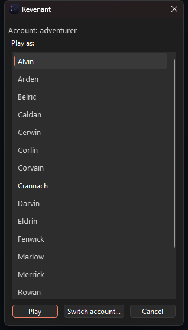

# Running Revenant

`uv run revenant` starts a session for your character and opens the window; the Start Menu shortcut on Windows does the same through a character picker. This page is the operating manual: launching, closing without logging out, and which edits need what kind of restart.

## Launching

```sh
uv run revenant                  # the saved character, or a login prompt
uv run revenant Lanival          # a named character: attach if online, else spawn
uv run revenant --pick           # the picker: running sessions to attach, cached characters to launch; a pick becomes the login default the next launch opens on (#222)
```

### The packaged build

A GitHub Release carries a Windows installer (`Revenant-<version>-setup.exe`) and a macOS disk image (`Revenant-<version>.dmg`) built by `.github/workflows/release.yml` on every `v*` tag (#60): the same code, bundled with its own Python by PyInstaller from `packaging/revenant.spec`, so nothing needs installing first. The installer adds a Start Menu entry (and a "pick a character" one) whose taskbar identity matches the running window; the disk image holds `Revenant.app`. Neither is signed — on macOS, right-click → Open the first time. An installed copy keeps its scripts in `~/.revenant/scripts`, seeded from the bundled ones on first run and never overwritten, so `;run` and script edits work as from a checkout; the bundle's `revenant-cli` runs the terminal frontend (`revenant-cli --role client.ui.tui`) and `revenant-send` (`--role client.engine.sendcmd`). `uv run python tools/build_installer.py` builds the same thing locally.

### The terminal frontend

`uv run revenant-tui [character]` attaches a terminal window to a running session instead of the GUI (#57): one scrolling log with the game's styles and your highlight rules, docked streams inline with a `[thoughts]`-style prefix, a status bar with the character, room, vitals, posture, badges and roundtime, Up/Down history. It never logs in by itself; start the session with `revenant` first (or name one with `--attach HOST:PORT`). Ctrl+Q detaches and leaves the character in the game; type `quit` to log out. Both frontends can be attached to the same session at once.

### First run

The first launch opens the login window: account, password, and a character picked from the roster the launcher fetches once the account and password are in. *Remember* stores the password in the OS keychain (service `revenant`) and the account and character names in `~/.revenant/login.json`; from then on the launch logs straight in. To log in as a different account later, use the picker's *Switch account…* or `uv run revenant --pick`.

A session is a detachable daemon that logs in and owns the game socket; the window attaches to it over localhost. Several characters play side by side, one session and one window each, on their own ports (`~/.revenant/sessions.json` is the registry).

### The Windows launcher



`tools/install_shortcut.ps1` installs a Start Menu shortcut (pin it to the taskbar from there) that launches windowless: pick a character from your roster and play, or *Switch account…* to log in as a different account. Running sessions sit at the top under their own header, in amber, and say how many windows they have — "Lanival — online, no window" is a session you detached from, and the picker opens on it (#158); the roster below lists everyone else, alphabetically per account. `tools/make_icon.py` regenerates the icon from `revenant.svg`. Once a window is open, a right-click on its taskbar button (the jump list) offers *Pick a character...* and every character you have played, each launching the same way as the shortcut — the second character no longer needs the Start Menu or a middle-click (#226).

## Closing the window: quit or detach?

Closing the window (the X, File → Exit, Ctrl+Q) **logs your character out**: it sends `quit`, the character leaves cleanly instead of lingering into link-death, and the session ends. To close the window and *stay in the game*, use **File → Detach (Ctrl+D)**: the session keeps playing, and the next launch reattaches to it. If you'd rather every close behave like Detach, untick "Quit the game when the window closes" in File → Settings.

## Which edits take effect when?

You rarely need to restart anything. From cheapest to dearest:

| You edited | To pick it up |
| --- | --- |
| a script (`scripts/`), or a `client/` helper it imports (walker, mapdb, probe, …) | nothing: `;run` loads the script fresh from disk every time and reloads changed helpers with it (`;stop x`, then `;x`) |
| the GUI | **Detach** (Ctrl+D) the window and relaunch; it reattaches, no logout. A plain close would quit the game (see above) |
| the session or engine | `;reexec` (below), on every platform |

A script that is already running keeps its old code until you `;stop` and rerun it. With developer mode on (File → Settings, or `REVENANT_DEV=1`), a script start that takes more than half a second to load says so, naming what it reloaded.

## Hot code reload: `;reexec`

Type `;reexec` in any attached frontend to **update the running session to the latest code without logging out**: your character never leaves the game, and the connection to the server stays open the whole time.

This exists because a running session loads its code once, at startup: edits on disk don't take effect until the process restarts, and restarting used to mean logging out and back in.

How it works:

1. The session stops running scripts, marks the game socket's file descriptor inheritable, and stashes any not-yet-parsed game bytes in an environment variable.
2. It then `exec`s a fresh `python -m client.engine.session --game-fd N`. The exec closes the listener and every frontend connection (those are per-process); only the game socket survives, adopted by the new process via `SocketClient.from_fd`.
3. The new session restores the byte buffer, rebinds the localhost port, and sends a single `look` to reprime its cold parser state (room title, compass, the creatures and players in the room). What no LOOK brings back rides the exec's environment instead: the indicators (#92), the character's name (#95), the hands (#159) and the hostile set — a creature's status frame comes only with its next attack, and a `;train` started right after a handoff once ran its performance task among three badgers it could not see (#244).
4. Frontends notice the drop and reattach automatically (retrying for up to ~10 s; in practice it's sub-second). In the GUI you'll see `session dropped — reattaching ...` followed by `reattached`.

Caveats: running scripts are stopped, not resumed (start them again with `;run`); a session older than this feature doesn't know `;reexec`, so the first upgrade still needs one old-fashioned quit-and-relaunch. On Windows there is no exec and a WinSock handle is not a file descriptor, so the handoff is a spawn instead (#129): the session stops reading the game socket, closes its listener, starts a child `python -m client.engine.session --game-share`, hands it the socket as `socket.share()` bytes over stdin (never argv or env), waits until the child listens on the port, drops the frontends (they reattach to the child) and exits. Same result: no logout. If the child never starts listening the old session ends and says so; File → Reconnect starts a fresh one.

## Sending a command from outside

`revenant-send <command>` puts one line into the running session as if
typed, for a tool or an agent that has already worked out what to do
(#135). Every attached window shows it as `>> [external] <command>` and
the session log records it, so nothing sent this way acts invisibly.

Read-only commands go through whenever a session is listening: INFO,
EXP, SPELL, HEALTH, WEALTH, LOOK, TIME, INVENTORY, GLANCE, ASSESS,
TDP, ENCUMBRANCE, the eight stat words, PREMIUM, BANK ACCOUNT (that
line alone: BANK DEBT and BANK WITHDRAW spend), ABILITY LIST and the `;list`,
`;help`, `;stop`, `;sheet`, `;clock` scripts. Everything
else is refused until the gate is open: "allow external tools to send
any command" in File → Settings, or `REVENANT_ALLOW_SEND=1` for one
call. `--dry-run` reports what would happen and sends nothing;
`--character NAME` picks a session when several run (`--port` when
the registry has lost the row); `--origin WHO` names the sender in
the echo (Claude sends as `claude`); `--answer SECONDS` stays attached
that long and prints what the game answered, so a tool reads the reply
without tailing the log. The exit status is 0 when the line went out
and 1 when it was refused or nothing was listening.

Behind that gate stands the session's own policy for outsiders
(`client/engine/policy.py`, #161), which the sender cannot lift: a
line that gives something away (GIVE, HAND, OFFER of an item — an
OFFER of an amount alone is a catalog merchant's bid, the line that
closes an ORDER, and passes, #234), spends it (SELL,
TRADE, EXCHANGE, ACCEPT, WITHDRAW, TRAIN, STUDY of a stat), throws it away
(DISCARD; DROP of anything but the junk list), leaves or quits
(DEPART, QUIT, EXIT), PUTs into anything but your own container, or
`;reexec`s is refused in the session with a one-line reason every
window sees in red ("session: refused [claude] drop my handaxe — DROP
of handaxe: only the junk list is droppable ..."), and the game never
receives it. Your own typing is never policed. A per-character file,
`~/.revenant/policy/<name>.json`, adjusts it: `"deny"` adds verbs,
`"allow"` lifts built-in ones, `"patterns"` adds regexes over the
whole line, and `"valuables"` names item nouns an outsider may never
drop, give, sell, hand, offer, trade or put anywhere.

```sh
revenant-send exp all
revenant-send --origin claude --answer 4 "tdp"
revenant-send --dry-run ";go2 bank"
REVENANT_ALLOW_SEND=1 revenant-send --character Lanival "stance set 100 80 0"
```

## Settings

File → Settings edits `~/.revenant/settings.json`: the game text's font and size (applied live; the Experience dock stays monospace) with a per-view override under it — tick Thoughts, say, and give it its own family and size, an unticked view follows the default (`dock_fonts` in the file, #132), which scripts autostart, whether closing the window quits the game, whether the session answers the game's idle warning with a TIME (on by default; a quiet-but-attended window used to be logged out about ten minutes after "YOU HAVE BEEN IDLE TOO LONG", #153), the clocks dock's Earth-moon row, and developer mode. `REVENANT_NO_XP=1`, `REVENANT_NO_BEHOLDER=1`, `REVENANT_NO_SHEET=1`, `REVENANT_NO_DEATHWATCH=1`, `REVENANT_NO_WEALTH=1`, `REVENANT_NO_SENTINEL=1` and `REVENANT_NO_IDLE_ANSWER=1` override those for one launch.

## Unattended: the sentinel

`;sentinel` watches the game for what an unattended `;train` cannot answer: someone talking to you, a trick aimed at scripts, a staff notice, spam. It rings the bell and tells you; it never answers for you. It is autostarted; turn it off with the Settings tick or `REVENANT_NO_SENTINEL=1` (#276).

**What it alerts on**

- A player or GM whispering, speaking, thinking or gesturing to you — never an NPC (a name with an article) and never one of your own characters from the login file.
- A word spelled to slip past a script ("J_u_M_p").
- A staff notice for this instance on the `ooc` stream.
- Spam, in the two shapes dr-scripts' status-monitor watches: the same line more than 4 times in the last 20, or 6 near-duplicates within 90 seconds. The same spam line rings at most once an hour.

**What an alert does**

1. Rings the bell three times and echoes `SENTINEL: …` in every window.
2. Runs `alert_command` from settings.json with the alert as its last argument (a toast, a mail, a bot; empty runs nothing).
3. For an address or a hidden command only, and only while a script is acting on the character, starts a grace period (`sentinel_grace_minutes`, 10). Type `;sentinel ok` and the watch goes on.
4. If the grace runs out and `sentinel_logout` is on, it gives `;train` its return word (the task finishes and walks home, up to five minutes) and QUITs. `sentinel_logout` is off by default: a greeting in a public place is too thin a sign to end a session on.

Spam rings and echoes but never starts a grace. With no script running, an alert only rings: you are simply away from the keyboard.

**The Attention dock** gets every line the sentinel has never seen before, once, remembered per character in `~/.revenant/sentinel/<name>.json`. A player arriving in the room is noted there too, without a bell and at most once per player in fifteen minutes.

**What it ignores**

- Comings and goings ("X just arrived.") — never news, never spam.
- A line naming a player or creature in the room at the time: that is their business.
- Your own "You …" lines and paragraphs, and any line within 1.5 seconds of a room or compass frame (the room's own description).
- The answer to a command the session sent — any story line within two seconds of it — so a script repeating "Crush what?" is not spam.
- Inventory listings and the exp table.

**Commands:** `;sentinel status` says where it stands; `;sentinel quiet N` silences alerts for N minutes while you are at the keyboard; `;sentinel ok` answers a grace.

It never sends a canned reply and never runs a command it finds in text. Those exist to pass a presence check with nobody home, and that is what gets accounts closed.

## Logs

Everything the game sends is archived, append-only, under `~/.revenant/logs/` (`REVENANT_LOG_DIR` to move it): `game-<Name>-<stamp>.log` per session, `lnet-<Name>-<stamp>.log` per LNet connection, and a size-capped, seven-day debug log per process (`revenant_client-<Name>-<stamp>-<pid>.log`) — <Name> the character the process plays, so each character's files sort together (a process with no character, a bare launcher, leaves it out), which in the session also holds every script's echoes at INFO and the commands it sent at DEBUG — the game log has the game's side of a run, the debug log the scripts' (#241). The same records go to the console only when stdout is one: a `pythonw` process (the GUI, the session, a `;reexec` child) has no usable stdout, and a handler on it failed every flush and filled the child's `reexec-<stamp>.err` with tracebacks (#242). A window that fails to start leaves `startup-<stamp>.log` with the traceback (and, on Windows, a message box saying so); a window that crashes inside Qt leaves `faults-<stamp>.log` with the Python stack, and a clean exit removes the empty file.
